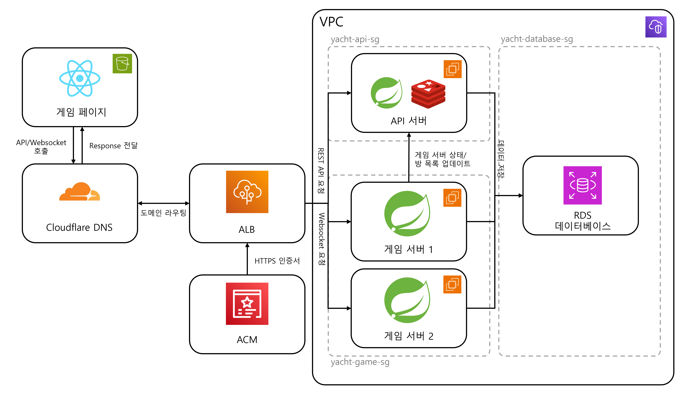

# Yacht Online

## A. 프로젝트 명

**Yacht Online**

AWS 기반 실시간 멀티플레이 Yacht Dice 웹 게임 클라우드 배포 프로젝트입니다.

---

## B. 프로젝트 멤버 이름 및 멤버 별 담당한 파트 소개

| 이름  | 담당 파트                                | 주요 담당 내용                                                                                                       |
| --- | ------------------------------------ | -------------------------------------------------------------------------------------------------------------- |
| 이준수 | Database / RDS                       | AWS RDS MySQL 구성, 보안 그룹 및 원격 접속 설정, 기존 로컬 스키마 이식, Spring Boot와 RDS 연동                                          |
| 최유렬 | Backend / Game Server / Redis / EC2  | 기존 yacht-dice 백엔드 구조 개선, API 서버와 WebSocket Game 서버 분리, Docker Compose 기반 로컬 테스트, Redis 도입, EC2 배포 및 ALB/RDS 연동 |
| 허소영 | Frontend Hosting / HTTPS / DNS / ALB | S3 정적 호스팅 구성, ACM 인증서를 활용한 HTTPS 환경 구성, Cloudflare DNS 도메인 연결, ALB 생성 및 EC2 연결                                 |

### 1. 이준수 : 데이터베이스 배포

AWS RDS MySQL 인스턴스를 생성하고, 보안 그룹을 설정하여 백엔드 EC2 인스턴스에서만 데이터베이스에 접근할 수 있도록 구성했습니다. 초기 스키마 이식 및 연동 확인을 위해 제한된 관리 환경에서 접속 테스트를 수행했습니다. 이후 기존 로컬 개발 환경에서 사용하던 `schema.sql`을 DBeaver를 활용하여 RDS에 이식하고, `users`, `games`, `played`, `game_rooms` 등의 핵심 테이블을 생성했습니다.

또한 Spring Boot 백엔드 서버가 RDS에 연결될 수 있도록 `application-dev.yml`의 datasource URL을 RDS 엔드포인트로 변경하고, 로컬 실행 환경에서 백엔드 서버와 RDS 간 연동 테스트를 진행했습니다. 
### 2. 최유렬 : 백엔드 구조 개선, 실시간 게임 서버 배포

기존에 개발되어 있던 `yacht-dice` 백엔드를 수정하여 일반 REST API를 처리하는 API 서버와 실시간 WebSocket 통신을 담당하는 Game 서버로 분리했습니다. 이를 통해 인증, 게임 룸 관리, 사용자 정보 조회와 같은 API 기능과 게임 진행 중 발생하는 실시간 이벤트 처리를 역할별로 나누어 관리할 수 있도록 했습니다.

또한 Docker Compose를 활용하여 로컬 환경에서 API 서버, Game 서버, Redis가 함께 동작하는지 테스트했습니다. Redis는 Game 서버의 상태 확인 및 서버 간 상태 관리에 활용했습니다. 이후 EC2 환경에 API 서버, Game 서버, Redis를 배포하고, RDS 및 ALB와 연동되도록 설정했습니다.

### 3. 허소영 : 프론트엔드 배포, 외부 접속 환경 구성

프론트엔드 정적 파일을 배포하기 위해 S3 버킷을 생성하고 정적 호스팅을 설정했습니다. 또한 ACM 인증서를 이용하여 HTTPS 접속 환경을 구성하고, Cloudflare DNS 레코드를 설정하여 도메인을 연결했습니다.

추가로 사용자의 요청이 백엔드 서버로 전달될 수 있도록 ALB를 생성하고 EC2 인스턴스와 연결하는 작업을 담당했습니다. 이를 통해 사용자는 도메인을 통해 서비스에 접속하고, 프론트엔드와 백엔드 기능을 클라우드 환경에서 사용할 수 있습니다.

---

## C. 프로젝트 소개

Yacht Online은 Yacht Dice 게임을 온라인에서 여러 사용자가 실시간으로 함께 플레이할 수 있도록 구현한 웹 기반 멀티플레이 게임 서비스입니다.

사용자는 웹 브라우저를 통해 서비스에 접속한 뒤 회원가입과 로그인을 진행할 수 있습니다. 로그인한 사용자는 게임 룸을 생성하거나 기존 게임 룸에 입장할 수 있으며, 최대 4명의 사용자가 하나의 게임 룸에서 함께 Yacht Dice 게임을 진행할 수 있습니다.

게임 중에는 주사위 굴리기, 주사위 고정 및 해제, 점수 카테고리 선택, 턴 변경 등의 이벤트가 실시간으로 처리됩니다. 이를 위해 클라이언트와 Game 서버는 WebSocket 기반으로 연결되며, STOMP 메시징 구조를 통해 게임 룸 단위로 게임 상태를 동기화합니다.

본 프로젝트는 AWS 기반 클라우드 환경에 배포되는 웹 서비스 형태를 목표로 했습니다. 프론트엔드는 S3 정적 호스팅을 통해 제공하고, 백엔드는 하나의 Spring Boot 코드베이스를 사용하되, 실행 프로필과 서버 Role 설정을 통해 API 서버 모드와 Game 서버 모드로 나누어 실행했습니다. 배포 환경에서는 API 서버 EC2와 Game 서버 EC2를 분리하여 역할별로 트래픽을 처리하도록 구성했습니다. 데이터베이스는 AWS RDS MySQL을 사용하며, 실시간 게임 서버의 상태 관리를 위해 Redis를 도입했습니다. 또한 Cloudflare DNS, ACM 인증서, ALB를 활용하여 도메인 기반 HTTPS 접속 및 백엔드 트래픽 전달 구조를 구성했습니다.

---

## D. 프로젝트 필요성 소개

온라인 멀티플레이 보드게임은 사용자가 같은 장소에 있지 않아도 함께 게임을 즐길 수 있다는 장점이 있습니다. Yacht Dice는 주사위를 굴리고 점수 조합을 선택하는 방식의 턴제 게임으로, 규칙이 비교적 간단하면서도 전략적인 판단이 필요한 게임입니다. 이를 온라인 서비스로 구현하면 장소와 시간의 제약 없이 친구나 가족과 함께 플레이할 수 있습니다.

또한 Yacht Dice와 같은 턴제 멀티플레이 게임은 클라우드 기반 웹 서비스 구조를 학습하기에 적합합니다. 단순 게시판이나 정적 웹 페이지와 달리, 사용자의 실시간 액션을 다른 참여자에게 즉시 전달해야 하므로 WebSocket 기반 양방향 통신이 필요합니다. 또한 사용자 계정, 게임 룸, 게임 결과, 랭킹 정보를 안정적으로 저장하기 위해 데이터베이스와의 연동도 필요합니다.

본 프로젝트의 필요성은 다음과 같이 정리할 수 있습니다.

1. **실시간 멀티플레이 서비스 구현 경험**
   * HTTP 요청/응답 방식만으로는 처리하기 어려운 실시간 게임 상태 동기화를 WebSocket으로 구현했습니다.

1. **클라우드 인프라 기반 서비스 배포 경험**
   * S3, EC2, RDS, ALB, ACM, Cloudflare DNS를 활용하여 실제 서비스와 유사한 클라우드 배포 구조를 구성했습니다.

1. **서버 역할 분리 경험**
   * REST API 서버와 WebSocket Game 서버를 분리하여 기능별 책임을 나누고, 실시간 처리 구조를 더 명확하게 설계했습니다.

1. **프론트엔드, 백엔드, 데이터베이스, 인프라 통합 경험**
   * 화면 구현, API 서버, 실시간 통신 서버, DB 저장, Redis 상태 관리, 도메인 연결, HTTPS 설정을 하나의 서비스로 통합했습니다.

1. **확장 가능한 게임 서비스 구조 설계**
   * 향후 사용자가 증가할 경우 API 서버와 Game 서버를 독립적으로 확장하거나, ALB와 Redis를 기반으로 다중 서버 구조로 확장할 수 있는 기반을 마련했습니다.

---

## E. 관련 기술/논문/특허 조사 내용 소개

### 1. Board Game Arena

Board Game Arena는 다양한 보드게임을 온라인에서 플레이할 수 있도록 제공하는 대표적인 온라인 보드게임 플랫폼입니다. Yatzy와 같이 Yacht Dice와 유사한 주사위 게임도 제공하며, 여러 사용자가 실시간으로 접속하여 게임을 진행할 수 있습니다.

다만 Board Game Arena는 이미 완성된 대규모 상용 플랫폼에 가깝기 때문에, 클라우드 인프라 구성이나 백엔드 배포 구조를 직접 학습하기에는 적합하지 않습니다. 본 프로젝트는 Yacht Dice라는 특정 게임을 직접 구현하고, 이를 AWS 기반으로 배포한다는 점에서 차별점이 있습니다.

* 출처: https://boardgamearena.com

### 2. Tabletopia / Tabletop Simulator

Tabletopia와 Tabletop Simulator는 다양한 보드게임을 가상 공간에서 플레이할 수 있도록 지원하는 플랫폼입니다. 그래픽 중심의 시뮬레이션 환경을 제공하며, 사용자는 실제 보드게임을 가상 테이블 위에서 조작하는 것처럼 플레이할 수 있습니다.

본 프로젝트는 이러한 그래픽 중심의 보드게임 시뮬레이터와 달리, 웹 브라우저에서 바로 접근 가능한 경량 웹 서비스 형태를 목표로 했습니다. 또한 게임 로직과 실시간 통신, 데이터 저장, 클라우드 배포 구조를 직접 구현했다는 점에서 차별화됩니다.

* 출처: https://tabletopia.com

### 3. Spring Boot + WebSocket 기반 실시간 서비스

WebSocket은 채팅 서비스, 알림 서비스, 실시간 협업 도구, 실시간 게임 서버 등에서 널리 활용됩니다. 특히 STOMP를 함께 사용하면 메시지 발행과 구독 구조를 명확히 나눌 수 있어 게임 룸별 메시지 브로드캐스트 구조를 구현하기 쉽습니다.

본 프로젝트에서는 Spring Boot 기반 서버에 WebSocket, STOMP, SockJS를 적용하여 게임 룸 단위로 실시간 게임 상태를 동기화했습니다. 또한 JWT 인증, 게임 룸 관리, 턴 타임아웃 자동 처리, 게임 결과 저장까지 하나의 서비스로 통합했다는 점에서 단순 채팅 예제와 차별화됩니다.

- 출처:
   -  https://spring.io/projects/spring-boot
   - https://docs.spring.io/spring-framework/reference/web/websocket/stomp.html

### 4. AWS 기반 웹 서비스 배포

AWS S3는 정적 웹 파일을 호스팅하는 데 사용할 수 있고, EC2는 애플리케이션 서버 실행 환경을 제공합니다. RDS는 관리형 관계형 데이터베이스로, 데이터베이스 설치와 운영 부담을 줄여줍니다. ALB는 외부 요청을 여러 서버로 전달하는 로드 밸런서 역할을 수행하며, ACM은 HTTPS 인증서 관리에 사용됩니다.

본 프로젝트에서는 프론트엔드 정적 파일을 S3에 배포하고, 백엔드 API 서버와 Game 서버를 EC2에 배포했습니다. 데이터베이스는 RDS MySQL을 사용했으며, ALB와 HTTPS 설정을 통해 외부 사용자가 안정적으로 서비스에 접근할 수 있도록 구성했습니다.

- 출처: 
   - https://docs.aws.amazon.com/AmazonS3/latest/userguide/Welcome.html
   - https://docs.aws.amazon.com/ko_kr/AmazonRDS/latest/UserGuide/Welcome.html
   - https://docs.aws.amazon.com/elasticloadbalancing/latest/application/introduction.html
   - https://docs.aws.amazon.com/ko_kr/acm/latest/userguide/acm-overview.html


### 5. Redis 기반 상태 관리

Redis는 메모리 기반 데이터 저장소로, 빠른 읽기와 쓰기가 필요한 상태 관리에 자주 사용됩니다. 실시간 게임 서버에서는 서버 상태 확인, 임시 게임 상태 저장, 세션성 데이터 관리 등에 활용할 수 있습니다.

본 프로젝트에서는 API 서버와 Game 서버가 분리된 구조에서 Game 서버의 상태 확인 및 실시간 처리 보조를 위해 Redis를 도입했습니다.

- 출처: https://redis.io/docs/latest/get-started/
---

## F. 프로젝트 개발 결과물 소개

### 1. 전체 시스템 구조



### 2. 시스템 구성 요소

#### S3 정적 웹 호스팅(게임 페이지)

사용자는 별도의 프로그램 설치 없이 웹 브라우저를 통해 게임 페이지에 접속합니다. 회원가입, 로그인, 게임 룸 생성, 게임 룸 입장, 주사위 굴리기, 점수 선택 등의 동작을 수행합니다.

이러한 게임 페이지는 리액트 프레임워크를 이용해 개발되었으며, 빌드 결과물인 HTML, CSS, JavaScript 파일을 S3 버킷에 업로드되어 정적 웹 사이트 형태로 제공되도록 하였습니다. 사용자는 브라우저에서 S3에 배포된 프론트엔드에 접속하고, 프론트엔드는 백엔드 API 및 WebSocket 서버와 통신합니다.

#### Cloudflare DNS

Cloudflare DNS는 사용자가 입력한 도메인을 실제 서비스 엔드포인트로 연결하는 역할을 합니다. 이를 통해 사용자는 IP 주소가 아닌 도메인 기반으로 서비스에 접근할 수 있습니다.

#### ACM 인증서 및 HTTPS

ACM 인증서를 활용하여 HTTPS 접속 환경을 구성했습니다. 이를 통해 사용자의 브라우저와 서버 간 통신을 암호화하고, 도메인 기반 보안 접속이 가능하도록 했습니다.

#### ALB

ALB는 외부에서 들어오는 API 요청과 WebSocket 요청을 EC2 인스턴스의 백엔드 서버로 전달합니다. REST API 요청은 API 서버로, 실시간 게임 통신 요청은 Game 서버로 전달되도록 구성했습니다.

#### API Server

API 서버는 Spring Boot 기반으로 구현되었으며, 회원가입, 로그인, 게임 룸 생성, 게임 룸 조회, 랭킹 조회 등 일반적인 REST API 요청을 처리합니다. 사용자 인증에는 JWT를 사용하고, 사용자 계정 및 게임 관련 데이터는 RDS에 저장합니다.

#### Game Server

Game 서버는 Spring Boot WebSocket 기반으로 구현되었으며, 실시간 게임 진행을 담당합니다. 사용자의 주사위 굴리기, 주사위 고정 및 해제, 점수 카테고리 선택, 턴 전환 등의 이벤트를 WebSocket STOMP 메시지로 처리합니다. 서버는 게임 룸 단위로 상태를 갱신하고, 같은 게임 룸의 모든 사용자에게 변경된 게임 상태를 브로드캐스트합니다.

#### AWS RDS MySQL

AWS RDS MySQL은 사용자 계정 정보, 게임 룸 정보, 게임 결과, 누적 점수 및 랭킹 데이터를 저장합니다. 기존 로컬 개발 환경에서 사용하던 `schema.sql`을 기반으로 RDS에 핵심 테이블을 생성했습니다.

주요 테이블은 다음과 같습니다.

| 테이블          | 설명                    |
| ------------ | --------------------- |
| `users`      | 사용자 계정 정보 저장          |
| `games`      | 게임 진행 및 결과 정보 저장      |
| `played`     | 사용자별 게임 참여 기록 및 점수 저장 |
| `game_rooms` | 게임 룸 정보 저장            |

#### Redis

Redis는 API EC2 내부에서 실행되며, Game 서버 상태 확인, 방 목록 관리, 서버 간 상태 공유를 위한 임시 데이터 저장소로 사용했습니다.

---

### 3. 주요 기능

#### 회원 및 인증 기능

* 회원가입
* 로그인
* JWT 기반 사용자 인증
* 인증된 사용자 기준 API 요청 처리
* WebSocket 연결 시 사용자 식별

#### 게임 룸 기능

* 게임 룸 생성
* 게임 룸 목록 조회
* 게임 룸 입장
* 게임 룸 퇴장
* 준비 상태 변경
* 모든 참가자 준비 완료 시 게임 시작

#### 실시간 게임 기능

* 게임 룸 단위 WebSocket 구독
* 주사위 굴리기
* 주사위 고정 및 해제
* 점수 카테고리 선택
* 점수 자동 계산
* 턴 전환
* 3분 턴 타임아웃 자동 처리
* 게임 종료 및 최종 결과 전송

#### 결과 저장 기능

* 게임 종료 후 최종 점수 저장
* `played` 테이블 기반 사용자별 게임 기록 저장

#### 배포 및 운영 기능

* S3 기반 프론트엔드 정적 호스팅
* EC2 기반 API 서버 및 Game 서버 배포
* RDS MySQL 연동
* Redis 기반 상태 관리
* ALB 기반 백엔드 트래픽 전달
* ACM 인증서 기반 HTTPS 접속
* Cloudflare DNS 기반 도메인 연결
* Docker Compose 기반 서버 실행 및 관리

---

### 4. 데이터 및 명령 흐름

#### 프론트엔드 접속 흐름

1. 사용자가 웹 브라우저에서 서비스 도메인으로 접속합니다.
2. Cloudflare DNS가 도메인을 서비스 엔드포인트로 연결합니다.
3. 사용자는 S3에 배포된 정적 프론트엔드 파일을 내려받습니다.
4. 브라우저에서 실행된 프론트엔드 애플리케이션이 백엔드 API 및 WebSocket 서버와 통신합니다.

#### 인증 및 조회 흐름

1. 사용자가 로그인 또는 회원가입 요청을 보냅니다.
2. 요청은 ALB를 거쳐 API 서버로 전달됩니다.
3. API 서버는 RDS MySQL에서 사용자 정보를 조회하거나 저장합니다.
4. 인증에 성공하면 JWT를 발급합니다.
5. 클라이언트는 이후 API 요청에서 JWT를 사용합니다.

#### 게임 룸 생성 및 입장 흐름

1. 사용자가 게임 룸 생성을 요청합니다.
2. API 서버는 게임 룸 정보를 생성하고 RDS에 저장합니다.
3. 다른 사용자는 게임 룸 목록을 조회한 뒤 해당 룸에 입장합니다.
4. 참가자 정보는 서버에서 관리되며, 필요한 경우 WebSocket을 통해 룸 내 사용자들에게 입장 이벤트가 전달됩니다.

#### 실시간 게임 액션 흐름

1. 사용자가 주사위를 굴리거나 점수 카테고리를 선택합니다.
2. 클라이언트는 WebSocket STOMP 메시지를 Game 서버로 전송합니다.
3. Game 서버는 해당 액션이 현재 턴과 게임 규칙에 맞는지 검증합니다.
4. Game 서버는 게임 상태를 갱신합니다.
5. 갱신된 게임 상태를 같은 게임 룸의 모든 참가자에게 브로드캐스트합니다.
6. 각 클라이언트는 수신한 메시지를 바탕으로 화면을 갱신합니다.

#### 게임 종료 및 랭킹 갱신 흐름

1. 모든 라운드가 종료되면 Game 서버가 최종 점수를 계산합니다.
2. 게임 결과가 RDS MySQL의 `played` 등 관련 테이블에 저장됩니다.
3. 저장된 데이터를 바탕으로 사용자 랭킹이 갱신됩니다.
4. 사용자는 게임 종료 화면 또는 랭킹 화면에서 최종 결과와 순위를 확인할 수 있습니다.

---

### 5. 레포지토리 구조

본 레포지토리는 프론트엔드(`yacht-frontend`)와 백엔드(`yacht-backend`)를 하나의 저장소에서 관리하는 모노레포 구조를 가집니다.

백엔드의 경우 `api-server`와 `game-server`가 별도의 폴더로 나뉜 것이 아니라, 하나의 Spring Boot 애플리케이션 내에서 실행 프로필(Profile)과 어노테이션 기반 Role 설정을 통해 논리적으로 서버의 역할을 분리하여 구동되도록 설계되었습니다.

```text
yacht-online/
├── README.md                       # 통합 레포지토리 프로젝트 메인 설명 문서
├── yacht-frontend/                 # React(Vite) 기반 프론트엔드 애플리케이션
│   ├── src/
│   │   ├── components/             # 페이지 및 UI 컴포넌트 
│   │   ├── lib/                    # 핵심 비즈니스 로직
│   │   ├── App.jsx                 # 프론트엔드 메인 라우팅
│   │   └── main.jsx                # 애플리케이션 진입점
│   ├── APIS.md                     # 클라이언트-서버 간 API 연동 명세
│   ├── package.json                # 프론트엔드 패키지 의존성 명세
│   └── vite.config.js              # Vite 프레임워크 빌드 설정
└── yacht-backend/                  # Spring Boot 기반 백엔드 (API/Game 통합 모듈)
    ├── src/main/java/.../yachtbackend/
    │   ├── auth/                   # JWT 토큰 발급 및 필터 인증 로직
    │   ├── config/                 # Security, WebSocket 설정 및 서버 Role 분리
    │   ├── game/                   # 요트 다이스 규칙 및 타이머 처리
    │   ├── gameroom/               # 대기방 로비 API 및 게임 방 내부 STOMP 컨트롤러
    │   ├── server/                 # Redis 기반의 게임 서버 레지스트리 
    │   └── user/                   # 사용자 계정 관리 및 DB 연동
    ├── src/main/resources/
    │   ├── application.yml         # 애플리케이션 공통 및 기본 프로퍼티
    │   ├── application-api.yml     # API 서버 모드 구동 시 전용 프로퍼티
    │   ├── application-game.yml    # Game 서버 모드 구동 시 전용 프로퍼티
    │   └── schema.sql              # RDS 이식을 위한 초기 DB 스키마 DDL
    ├── build.gradle                # 백엔드 의존성 관리 및 빌드 스크립트
    ├── Dockerfile                  # 백엔드 애플리케이션 컨테이너 이미지화 명세
    ├── docker-compose.yml          # 로컬 및 운영 환경 통합 인프라 실행
    └── .env.example                # 컨테이너 구동에 필요한 환경 변수 템플릿
```


---

## G. 개발 결과물을 사용하는 방법 소개
### 0. 게임 페이지 사용 예


### 1. 동작 환경

#### 서버 환경

* AWS EC2
* Ubuntu 22.04
* Java 21, Amazon Corretto 21
* Spring Boot
* Docker
* Docker Compose
* Redis
* AWS RDS MySQL 8.0
* AWS ALB
* AWS ACM
* Cloudflare DNS

#### 클라이언트 환경

* PC 또는 노트북 웹 브라우저
* Chrome, Firefox, Safari, Edge 등 최신 브라우저
* 모바일 브라우저 접속 가능

---

### 2. 프로젝트 클론

```bash
git clone https://github.com/yuyeol3/yacht-online.git
cd yacht-online
```

---

### 3. 환경 변수 설정

프로젝트 실행 전 `.env` 파일을 생성합니다.

```bash
cp .env.example .env
```

예시:

```env
MYSQL_HOST=[RDS 엔드포인트]
MYSQL_PORT=3306
MYSQL_DATABASE=yacht
MYSQL_USER=[DB 사용자명]
MYSQL_PASSWORD=[DB 비밀번호]

REDIS_HOST=[Redis 서버 주소]
REDIS_PORT=6379

JWT_SECRET=[JWT_SECRET_KEY]

API_SERVER_PORT=8080
GAME_SERVER_PORT=8081

SPRING_PROFILES_ACTIVE=prod
```

실제 제출 시에는 보안상 민감한 값이 포함된 `.env` 파일을 GitHub에 업로드하지 않습니다. 대신 `.env.example` 파일을 제공하여 필요한 환경 변수 목록만 안내합니다.

---

### 4. Docker Compose로 서버 실행

```bash
docker compose up -d --build
```

실행 중인 컨테이너 확인:

```bash
docker compose ps
```

로그 확인:

```bash
docker compose logs -f
```

서비스 중지:

```bash
docker compose down
```

---

### 5. 프론트엔드 배포

프론트엔드는 빌드 후 S3 버킷에 업로드하여 정적 웹 사이트로 배포합니다.

```bash
cd yacht-frontend
npm install
npm run build
```

빌드 결과물은 S3 버킷에 업로드합니다.

```bash
aws s3 sync dist/ s3://[S3 버킷 이름] --delete
```

프론트엔드 빌드 디렉터리 이름은 사용하는 프레임워크에 따라 `dist` 또는 `build`로 달라질 수 있습니다.

---

### 6. 접속 방법

배포 완료 후 사용자는 다음과 같은 주소로 접속합니다.

```text
https://[서비스 도메인]
```

로컬 테스트 환경에서는 다음 주소를 사용할 수 있습니다.

```text
http://localhost
```

---

### 7. 주요 사용 흐름

1. 사용자가 웹 브라우저에서 서비스 도메인으로 접속합니다.
2. 회원가입 또는 로그인을 진행합니다.
3. 로그인 후 게임 룸을 생성하거나 기존 게임 룸에 입장합니다.
4. 참가자들이 준비 상태를 변경합니다.
5. 모든 참가자가 준비되면 게임이 시작됩니다.
6. 각 사용자는 자신의 턴에 주사위를 굴립니다.
7. 원하는 주사위를 고정하거나 해제합니다.
8. 굴림 기회가 끝나면 점수 카테고리를 선택합니다.
9. 제한 시간 3분을 초과하면 서버가 자동으로 다음 턴으로 전환합니다.
10. 모든 턴이 종료되면 최종 점수가 계산되고, 결과가 RDS에 저장됩니다.
11. 사용자는 최종 결과와 랭킹을 확인할 수 있습니다.

---


### 8. 주요 API 및 WebSocket 경로

#### REST API 예시

| 기능         | Method | URL                |
| ---------- | ------ | ------------------ |
| 회원가입       | POST   | `/api/auth/signup` |
| 로그인        | POST   | `/api/auth/login`  |
| 게임 룸 목록 조회 | GET    | `/api/rooms`       |
| 게임 룸 생성    | POST   | `/api/rooms`       |
| 랭킹 조회      | GET    | `/api/rankings`    |

#### WebSocket 예시

| 기능           | 경로                         |
| ------------ | -------------------------- |
| WebSocket 연결 | `/ws`                      |
| 게임 룸 구독      | `/topic/rooms/{roomId}`    |
| 게임 액션 전송     | `/app/rooms/{roomId}/game` |

실제 경로는 구현 코드 기준으로 수정해야 합니다.

---

## H. 개발 결과물의 활용방안 소개

본 프로젝트는 다음과 같은 방식으로 활용될 수 있습니다.

### 1. 온라인 멀티플레이 보드게임 서비스

사용자는 친구나 가족과 같은 장소에 있지 않아도 웹 브라우저를 통해 Yacht Dice 게임을 함께 즐길 수 있습니다. 별도 프로그램 설치 없이 접속할 수 있기 때문에 접근성이 높습니다.

### 2. 실시간 웹 서비스 학습 예제

WebSocket을 활용하여 서버와 클라이언트 간 실시간 상태 동기화를 구현했기 때문에, 채팅 서비스, 실시간 알림 서비스, 협업 도구, 실시간 퀴즈 서비스와 같은 프로젝트의 기본 구조로 활용할 수 있습니다.

### 3. 클라우드 배포 실습 예제

S3, EC2, RDS, ALB, ACM, Cloudflare DNS를 사용하여 정적 웹 호스팅, 애플리케이션 서버, 데이터베이스, HTTPS, 도메인 연결을 구성했기 때문에 클라우드 기반 웹 서비스 배포 실습 사례로 활용할 수 있습니다.

### 4. 서버 분리 구조 학습 예제

REST API 서버와 WebSocket Game 서버를 분리했기 때문에, 서버 역할 분리와 실시간 서버 구조를 학습하는 예제로 활용할 수 있습니다.

### 5. 확장 가능한 게임 서버 구조의 기반

현재 구조는 향후 다음과 같이 확장할 수 있습니다.

* API 서버와 Game 서버의 독립적 확장
* ALB 대상 그룹을 통한 서버 증설
* Redis 기반 다중 Game 서버 상태 공유
* RDS 성능 개선 및 읽기 복제본 구성
* CloudWatch 알람 기반 장애 대응
* GitHub Actions 기반 CI/CD 파이프라인 구축

---

## I. AI 활용

본 프로젝트 개발 과정에서 AI 도구를 일부 활용했습니다.

| AI 도구   | 활용 목적                                            |
| ------- | ------------------------------------------------ |
| ChatGPT | 코드 구조 검토, 오류 원인 분석, 클라우드 배포 설정 검토, README 템플릿 작성 |
| Codex   | 프론트엔드 코드 생성, 기존 백엔드 코드 분리 리팩토링, 테스트 코드 작성        |

### AI 활용 범위

AI는 주로 다음 작업에 활용했습니다.

* Spring Boot와 WebSocket 구조 설계 검토
* API 서버와 Game 서버 분리 구조 검토
* JWT 인증 흐름 검토
* Docker Compose 설정 검토
* AWS EC2, RDS, ALB, S3, ACM, Cloudflare DNS 구성 관련 문제 해결 방향 검토
* CORS 및 WebSocket 연결 문제 해결 방향 검토
* Redis 도입 및 서버 상태 관리 방식 검토
* README.md 및 발표 자료 구성 초안 작성
* 오류 로그 분석 및 디버깅 방향 검토

### AI가 생성한 코드 비율

전체 코드 중 AI의 제안을 참고하여 작성하거나 수정한 비율은 약 40%입니다.
단, 프로젝트의 핵심 구조 결정, 최종 코드 작성, 기능 검증, 배포 확인은 팀원이 직접 수행했습니다. AI가 제안한 내용은 그대로 사용하지 않고, 프로젝트 요구사항과 실제 실행 결과에 맞게 수정 및 검증한 뒤 반영했습니다.

## 실행 화면 및 데모

### 1. 메인 화면

```md

```

### 2. 로그인 화면

```md

```

### 3. 게임 룸 화면

```md

```

### 4. 게임 진행 화면

```md

```

### 5. 랭킹 화면

```md

```

---

